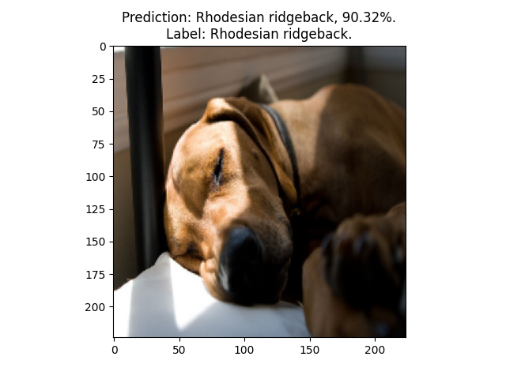
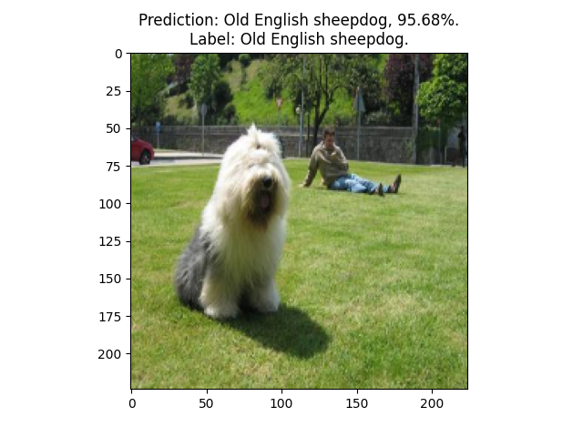
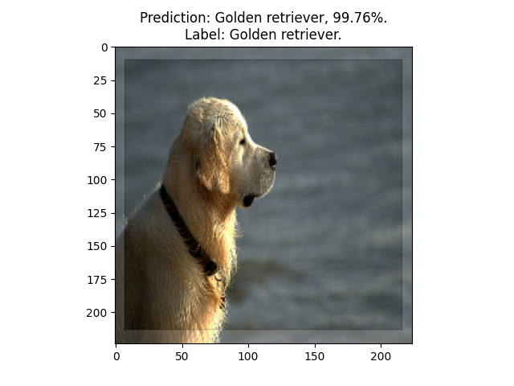
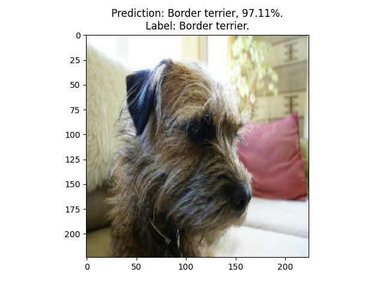
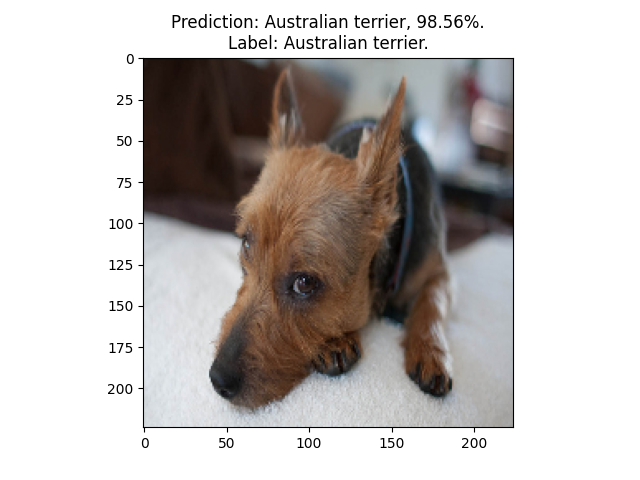

# PyTorch ImageWoof classifier
Scripts for training and testing ImageWoof classifier using randomly 
initialized EfficientNet.

### 1. Prepare to work

* Clone and cd the project:
```shell
git clone https://github.com/Chifffa/imagewoof_pytorch.git
cd imagewoof_pytorch
```
* Install all dependencies:
```shell
pip install -r requirements.txt
```
* Download ImageWoof dataset from
  [here](https://s3.amazonaws.com/fast-ai-imageclas/imagewoof2.tgz "Download ImageWoof dataset").
* Extract it to project folder or specify `DATASET_PATH` in `config.py`.
* Specify other training parameters if necessary.

### 2. Training classifier

Use `train.py` for training the classifier.

Run this to visualise augmented images with labels:
```shell
python train.py --show
```
Run `python train.py` to start training or `python train.py --help` to see all additional parameters.

### 3. Evaluate classifier

Use `test.py` for evaluating the classifier.

Run this to visualise testing images with labels and predictions:
```shell
python test.py --show --weights weights/best.pts
```

Run without `--show` to evaluate loss and metrics and then visualise:
```shell
python test.py --weights weights/best.pts
```

Evaluating results:
```text
Testing: loss = 0.5773, accuracy = 0.8180.

                      precision    recall  f1-score   support

            Shih-Tzu       0.79      0.85      0.82       409
 Rhodesian ridgeback       0.85      0.84      0.84       408
              Beagle       0.72      0.84      0.78       418
    English foxhound       0.82      0.50      0.62       224
      Border terrier       0.90      0.77      0.83       401
  Australian terrier       0.88      0.82      0.85       407
    Golden retriever       0.81      0.83      0.82       401
Old English sheepdog       0.90      0.82      0.85       422
             Samoyed       0.82      0.93      0.87       429
               Dingo       0.75      0.84      0.79       410

            accuracy                           0.82      3929
           macro avg       0.82      0.80      0.81      3929
        weighted avg       0.82      0.82      0.82      3929
```

Here are some prediction examples:





